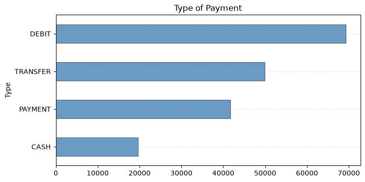
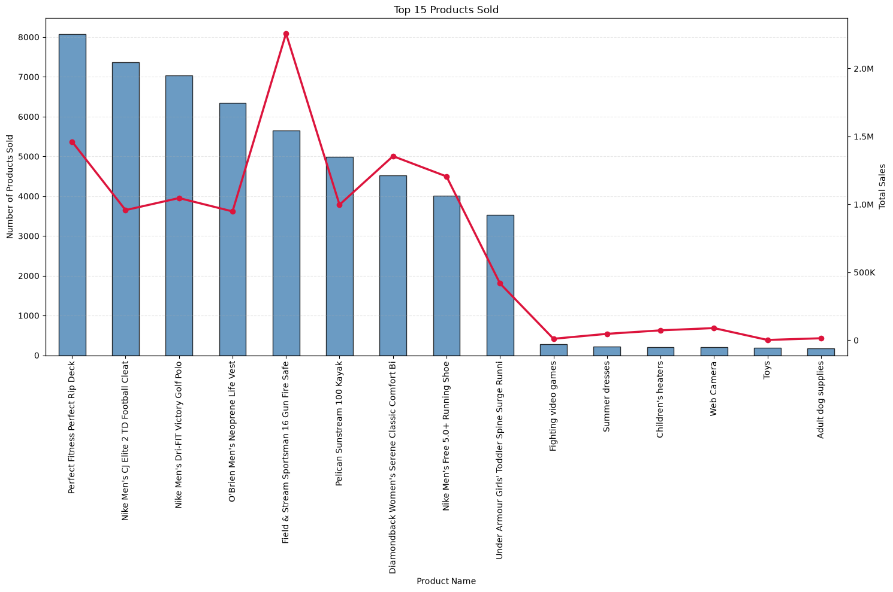
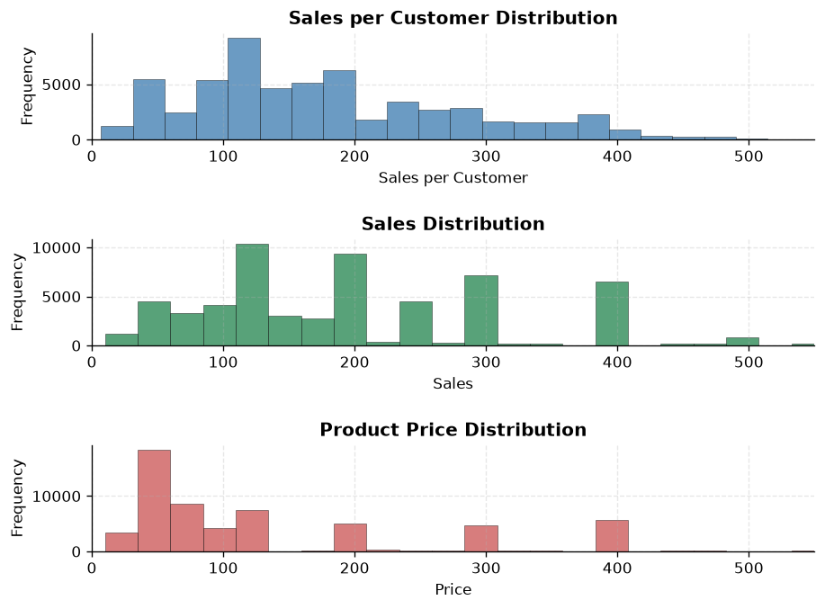
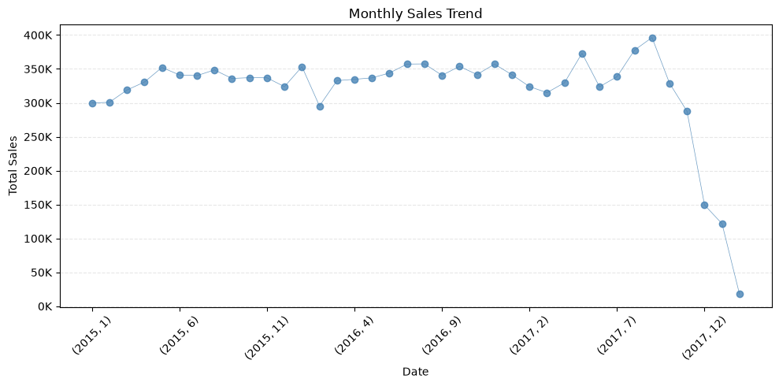
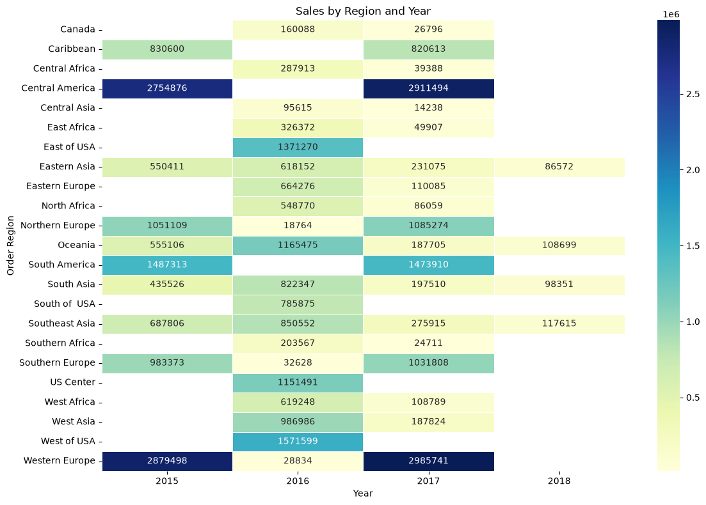

# Project Overview

This project analyzes **Super Store supply chain sales** using **Python** for cleaning and exploratory data analysis (EDA), and **Power BI** for an interactive performance dashboard.
The dataset contains **180,519 orders and 53 columns**, covering sales, profit, discounts, payment types, products, customers, and regions from **2015 to 2018**.


## Objectives

* Clean the raw supply chain data and remove duplicate, empty, and sensitive columns.
* Explore sales, profit, and price distributions using descriptive statistics.
* Identify top-selling products, sales trends over time, and the strongest regions.
* Export a clean dataset and build an **interactive Power BI dashboard** for decision-makers.


## Project Structure

```
PowerBI_Py_Super_Store_Sales_Analysis
│   README.md
│
├───Data
│       Supply_Chain_dataset.csv            # raw data
│       Supply_Chain_dataset_cleaned.csv    # cleaned data (COMPLETE orders only)
│
├───Python_EDA_&_Cleaning
│       1_Data_Cleaning.ipynb
│       2_Cleaning_P2_&_EDA.ipynb
│       3_Export_For_Power_BI_.ipynb
│
├───PowerBI_Dashboard
│       Power_BI_2B_Project.pbix
│
└───outputs                                 # charts + dashboard demo video
```


## Tools & Technologies

* **Python Libraries:** `pandas`, `matplotlib`, `seaborn`
* **BI Tool:** Power BI
* **Environment:** Jupyter Notebook / VS Code / GitHub


# Questions

1. **Which order statuses generate the most sales?**
2. **Which payment types are used the most?**
3. **What are the top 15 best-selling products?**
4. **How are sales, sales per customer, and product prices distributed?**
5. **How did monthly sales change over time?**
6. **Which regions generate the most sales each year?**
7. **How do discounts, benefit, and sales behave across markets in the dashboard?**


# Data Cleaning

The raw dataset was cleaned and prepared in `1_Data_Cleaning.ipynb` and `3_Export_For_Power_BI_.ipynb`:

```python
import pandas as pd

df = pd.read_csv(r"D:\Projects\Data\Supply_Chain_dataset.csv")

# Convert date columns
df['shipping_date_(DateOrders)'] = pd.to_datetime(df['shipping_date_(DateOrders)'])

# Drop unnecessary / sensitive columns
df = df.drop(columns=["Order_Zipcode", "Product_Description", "Product_Image",
                      "Customer_Email", "Product_Status", "Customer_Password",
                      "Longitude", "Latitude"])
df = df.dropna()
df = df.drop(columns="Order_Profit_Per_Order")   # identical to Benefit_per_order

# Remove columns with different names but identical values
duplicate_cols = []
for i in range(len(df.columns)):
    for j in range(i + 1, len(df.columns)):
        if df.iloc[:, i].equals(df.iloc[:, j]):
            duplicate_cols.append(df.columns[j])
df = df.drop(columns=duplicate_cols)

# Keep completed orders only and export for Power BI
df_Com_Stat = df[df['Order_Status'] == 'COMPLETE']
df_Com_Stat.to_csv(r"D:\Projects\Data\Supply_Chain_dataset_cleaned.csv")
```

1. **Date Conversion:** `shipping_date_(DateOrders)` and `order_date_(DateOrders)` converted to datetime.
2. **Dropped Columns:** Removed `Order_Zipcode`, `Product_Description`, `Product_Status`, `Product_Image`, `Customer_Email`, `Customer_Password`, `Longitude`, and `Latitude` (mostly empty, irrelevant, or sensitive).
3. **Missing Values:** Rows with null values were dropped.
4. **Duplicate Columns:** `Order_Profit_Per_Order` was identical to `Benefit_per_order`, and a loop found 5 more duplicates: `Order_Item_Total`, `Product_Category_Id`, `Customer_Password`, `Order_Customer_Id`, `Product_Card_Id`.
5. **Filtering:** Only **COMPLETE** orders were kept for the EDA and the dashboard.

### **Result**

* Consistent datetime columns, no duplicated or sensitive columns, and no missing values.
* A clean file ready for analysis and Power BI.


# The Analysis

## 1. Which order statuses generate the most sales?

I grouped the data by `Order_Status` and summed the sales for each one.

View my notebook in details here:
[2_Cleaning_P2_&_EDA.ipynb](Python_EDA_&_Cleaning/2_Cleaning_P2_&_EDA.ipynb)

### Results


### Insights

* **COMPLETE** orders lead with about **12.1M** in sales, followed by **PENDING_PAYMENT** (~8.1M) and **PROCESSING** (~4.5M).
* **CANCELED**, **SUSPECTED_FRAUD**, and **PAYMENT_REVIEW** are the smallest (under 1M each).
* The average benefit per order is very similar across all statuses (≈ 20–23), so the analysis continued with **COMPLETE** orders only.


## 2. Which payment types are used the most?

I counted the number of orders for each payment `Type`.

### Results


### Insights

* **DEBIT** is the most used payment type (~69K orders), followed by **TRANSFER** (~50K) and **PAYMENT** (~42K).
* **CASH** is the least used (~20K orders).


## 3. What are the top 15 best-selling products?

I grouped COMPLETE orders by `Product_Name`, counted the units sold, summed the sales, and kept the top 15.

### Results


### Insights

* **Perfect Fitness Perfect Rip Deck** is the most sold product (~8,000 units).
* **Field & Stream Sportsman 16 Gun Fire Safe** generates the **highest total sales (~2.2M)** with fewer units, thanks to its high price.
* There is a sharp drop after the 9th product, from ~3,500 units to fewer than 300 for the rest.


## 4. How are sales, sales per customer, and prices distributed?

I used `EDA()`, a custom function that returns min, max, mean, mode, quartiles, variance, standard deviation, skewness, and kurtosis, then plotted histograms for the three main variables.

### Results


### Insights

* **Sales** (mean ≈ 203) and **Sales per customer** (mean ≈ 183) are **strongly right-skewed** (skewness ≈ 3.1) with heavy tails (kurtosis ≈ 26).
* Sales and prices cluster around fixed values (~50, 200, 300, 400), which shows a limited set of price points.
* **Benefit per order** is skewed to the left (skewness ≈ -4.8): most orders earn a small profit (median = 32), but a few large losses reach **-4,275**.


## 5. How did monthly sales change over time?

I grouped the COMPLETE orders by year and month and summed the sales.

### Results


### Insights

* Sales were **stable at about 300K–350K per month** from 2015 to mid-2017, peaking near **395K** in late 2017.
* After that, sales **drop sharply** to under 20K in the last month, which likely reflects **incomplete data at the end of the period** rather than a real collapse.


## 6. Which regions generate the most sales each year?

I built a pivot table of sales by `Order_Region` and `Year`, and visualized it as a heatmap.

### Results


### Insights

* **Western Europe** and **Central America** are the top regions, each generating about **2.8M–3.0M** in both 2015 and 2017.
* **South America** (~1.5M), **Northern Europe**, and **Southern Europe** (~1.0M) follow.
* The 2016 values look different: sales appear under U.S. sub-regions (East, West, Center, South) and some regions are missing, suggesting **region naming changed between years**.
* 2018 contains only a few small records.


## 7. Power BI Dashboard

I exported the cleaned data and built an interactive **Super Store Performance Overview** dashboard.

🎥 Watch the dashboard demo: [Power_BI_2B_.mp4](outputs/Power_BI_2B_%20.mp4)

**Dashboard contents:**

* **KPI cards:** Total Sales (**$12.10M**), Total Orders (**127K**), and Average Benefit per Order (**$22.21**).
* **Total Order Quantity vs Total Discount per Market:** Europe is the highest, Africa the lowest.
* **Sales vs Order Item Discount Rate:** scatter plot of the discount impact on sales.
* **Order_State map:** geographic view of orders.
* **Benefit per order / Sales by Year and Month:** trend lines for 2015–2018.
* **Slicers:** Year/Quarter and Order Country for interactive filtering.

### Insights

* The dashboard confirms the Python findings: stable sales and benefit from 2015 to 2017, followed by a drop in 2018.
* Markets with higher order quantities, such as Europe, also receive higher total discounts.


# What I Learned

In this project I practiced the full workflow from raw data to dashboard: cleaning a large dataset, detecting hidden duplicate columns, and using descriptive statistics (skewness and kurtosis) to understand distributions. I also learned to combine **Python for analysis** with **Power BI for interactive reporting**.


# Insights

Completed orders bring about **12.1M in sales** with an average benefit of **$22.21** per order. Sales were stable across 2015–2017, led by **Western Europe** and **Central America**, while a few high-priced products (like the Fire Safe) drive revenue more than high-volume ones. Sales and profit are heavily skewed, meaning a small number of large orders and occasional big losses shape the totals.


# Challenges I Faced

* Handling a **180K-row, 53-column dataset** with many redundant columns.
* Finding duplicate columns that had different names but the same values.
* Inconsistent region names across years and incomplete data at the end of the period, which had to be interpreted carefully.


# Conclusion

This project cleaned a large supply chain dataset, explored sales, payment, product, and regional patterns with Python, and delivered an interactive Power BI dashboard. The analysis shows stable revenue through 2017, strong dependence on a few regions and high-value products, and skewed profit distributions, giving a clear base for deeper statistical tests and forecasting.